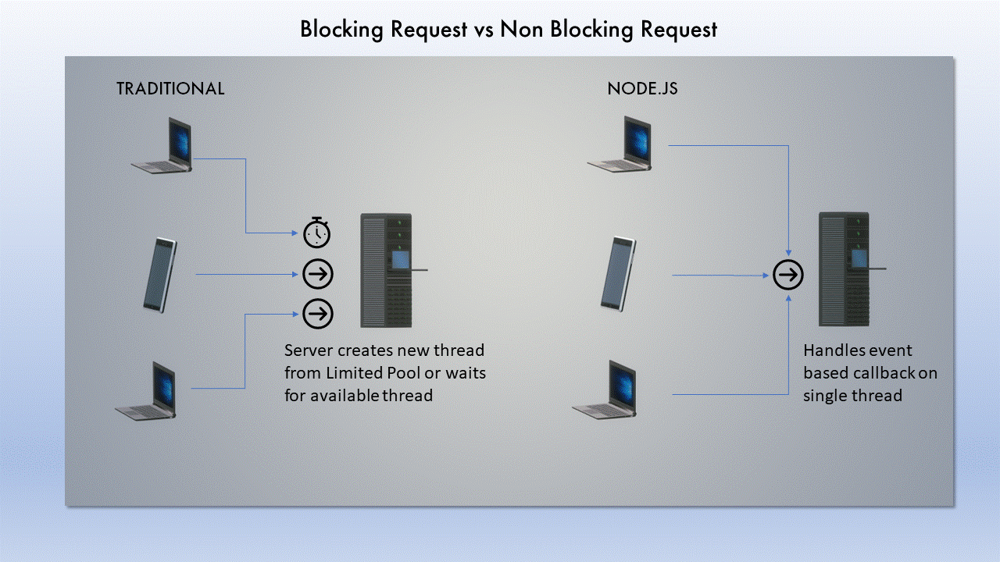

## Introduction NodeJs

Node.js is a JavaScript runtime built on Chrome's V8 JavaScript engine.
Chrome browser has V8 engine inbuilt which efficiently compile javascript code into optimized machine code and then executed on machine. Whenever javascript is to be executed outside browser, we need a runtime like NodeJs. NodeJs is designed to build scalable network applications.

HTTP is a first-class citizen in Node.js, designed with streaming and low latency in mind. This makes Node.js well suited for the foundation of a web library or framework.

### What is runtime

Runtime describes software/instructions that are executed while your program is running, especially those instructions that you did not write explicitly, but are necessary for the proper execution of your code.

> 💡
> Low-level languages like C have very small (if any) runtime. More complex languages like Objective-C, JavaScript, Java, which allows for dynamic message passing, have a much more extensive runtime. Here, V8 and many other script which wraps V8 engine written in C++ and makes available in javascript forms a NodeJS Runtime.

## NodeJs Architecture

In this section, we are going to explore that Why do we need NodeJs? Why node is fast compared other server technology?

- Non Blocking
- Event Driven
- Fast Processing
- Scalable technology for microservices.
- Open source and Many packages available on npm.

In a NodeJs application many connection is handled concurrently. Upon each connection/request nodeJs will pass a callback and callback is fired when the work is completed on server and response object is created and returned. If no work is to be done after all connection NodeJs will sleep and wait for event. This is makes NodeJs applications non blocking compared to traditional servers. It is lightweight and event Driven.



## Event Loop

NodeJs event loop as a runtime construct instead of as a library. In traditional system, there is always a blocking call to start the event-loop. Typically, behavior is defined through callbacks at the beginning of a script, and at the end a server is started through a blocking call. In Node.js, there is no such start-the-event-loop call. Node.js simply enters the event loop after executing the input script. Node.js exits the event loop when there are no more callbacks to perform. This behavior is same as browser JavaScript where the event loop is hidden from the user.

### Single Threaded does not mean one CPU cores will be used

As per nodejs documentation:

> Node.js being designed without threads doesn't mean you can't take advantage of multiple cores in your environment. Child processes can be spawned by using our child_process.fork() API, and are designed to be easy to communicate with. Built upon that same interface is the cluster module, which allows you to share sockets between processes to enable load balancing over your cores.

## Node installation

The official Node.js website has installation instructions for Node.js: [https://nodejs.org](https://nodejs.org)

### First NodeJs code

You need to save the code below in `hello.js` file.

```js
var http = require("http")

http
  .createServer(function (req, res) {
    res.writeHead(200, { "Content-Type": "text/plain" })
    res.end("Hello World!")
  })
  .listen(8080)
```

To run this file use the command to run on shell

```bash
node hello.js
```

You need to open browser and type this url [http://localhost:8080/](http://localhost:8080/) to see the result.
