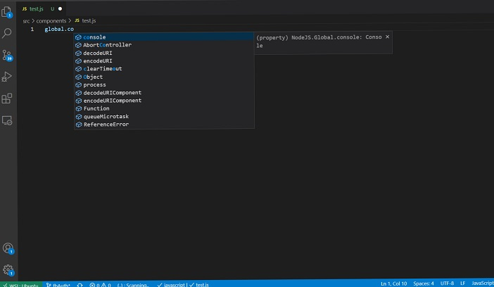

Module is a set of functions you want to include in your application.

Every js file is a module. If you want some functions or variables to be used outside the file you need to export it. Otherwise, every thing will be private to the module.

> 💡 In javascript you can not mark a functions or variable private.
> Here, the word private used to compare from Object Oriented Programming world.

## Global Modules

These objects are available in all modules.

To see global modules, type `global.` in vscode and wait for intellisense.



You will be surprised to see many modules which we use in day to day life are global modules. Like
|
`console`, `gc`, `process`, `url`

`setTimeOut`, `clearTimeOut`, `clearTimeInterval`, `setTimeInterval`  
All data types except primitive : `String`, `Date`, `undefined`

In browser: `window` is also global object.

The process object provides information about, and control over,the current NodeJs process. You will use process object to fetch environment variable e.g. development, production, staging.

### Core Modules

NodeJs is very light weight. It have only bare essential module in global module. Rest modules provided by NodeJs need to be imported.

In order to use core module we need a require function.

e.g. `var module = require('module_name');`

In the example below, you will see how to use node http module to create a server;

```js
var http = require("http")

var server = http.createServer(function (req, res) {
  //write code here
})

server.listen(5000)
```

Most used Core Modules are :

| Module Name  | Uses                                                                                                                                 |
| ------------ | ------------------------------------------------------------------------------------------------------------------------------------ |
| File System  | The fs module enables interacting with the file system.                                                                              |
| HTTP         | To use the HTTP server and client                                                                                                    |
| OS           | Provides operating system-related utility methods and properties.                                                                    |
| Path         | Provides utilities for working with file and directory.                                                                              |
| Query String | provides utilities for parsing and formatting URL query strings.                                                                     |
| Stream       | This is used for creating new types of stream instances. e.g. Request Object is an http.IncomingMessage, which is a readable stream. |

## Using npm

npm is the one of largest software registry. Open source developers from every continent use npm to share and borrow packages, and many organizations use npm to manage private development as well.

npm consists of three distinct components:

- the website
- the Command Line Interface (CLI)
- the registry
  Use the website to discover packages, set up profiles, and manage other aspects of your npm experience. For example, you can set up organizations to manage access to public or private packages.

The CLI runs from a terminal, and is how most developers interact with npm.

The registry is a large public database of JavaScript software and the meta-information surrounding it.

## Using yarn

Yarn is a package manager for your code. It allows you to use and share code with other developers from around the world. Yarn is also very popular and has almost same functionality as npm.
yarn help

### Yarn workspace

If you have more than one project in a folder you can configure yarn workspace where with single yarn install can resolve dependencies across all project and will generate a single lockfile. Now, similar concept is also available in npm.

| Uses                                              | npm command                | yarn command                 |
| ------------------------------------------------- | -------------------------- | ---------------------------- |
| Starting a new project                            | npm init                   | yarn init                    |
| Installing all the dependencies from package.json | npm install                | yarn or yarn install         |
| Adding a dependency                               | npm i [package]            | yarn add [package]           |
|                                                   | npm i [package]@[version]  | yarn add [package]@[version] |
|                                                   | npm i [package]@[tag]      | yarn add [package]@[tag]     |
| Adding dev dependency                             | npm i -D [Package]         | yarn add [package] --dev     |
|                                                   | npm i [Package] --save-dev |                              |
| Adding peer dependency                            | manually modify npm to add | yarn add [package] --peer    |
| Upgrading a dependency                            | npm up [package]           | yarn up [package]            |
|                                                   | npm up [package]@[version] | yarn up [package]@[version]  |
|                                                   | npm up [package]@[tag]     | yarn up [package]@[tag]      |
| Removing a dependency                             | npm un [package]           | yarn remove [package]        |
| List outdated module (Current , Wanted , Latest)  | npm outdated               | yarn outdated                |
| Upgrading npm/Yarn itself                         | npm install -g npm@latest  | yarn set version latest      |

> 💡 Before node 5.0.0, it was necessary to add --save option in npm add command. Now, it is default option and save dependencies in package.json

### Word of caution

For global packages, pick whichever is your favorite. I find yarn is faster, which is important to me. It does not matter what the application says to use.

Yarn and npm are interchangeable. As long as you use the same one each time, there is no difference between them. They have different install directories, which is why they can't be used together. Yarn will install a package, npm can't find it. npm will install a package, yarn can't find it.
