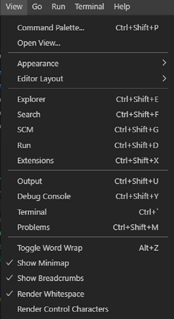
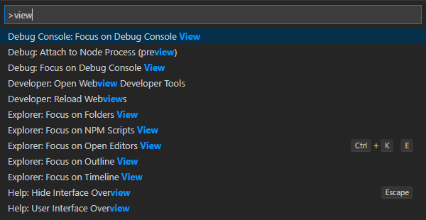

Different types of views and there layout in visual studio code.

## Layout

The UI is divided into five areas:

- Editor - The main area to edit your files. You can open as many editors as you like side by side vertically and horizontally.
- Side Bar - Contains different views like the Explorer to assist you while working on your project.
- Status Bar - Information about the opened project and the files you edit.
- Activity Bar - Located on the far left-hand side, this lets you switch between views and gives you additional context-specific indicators, like the number of outgoing changes when Git is enabled.
- Panels - You can display different panels below the editor region for output or debug information, errors and warnings, or an integrated terminal. Panel can also be moved to the right for more vertical space.

Each time you start VS Code, it opens up in the same state it was in when you last closed it. The folder, layout, and opened files are preserved.

## Views and Windows

For common views are listed under menu view

However, if you are a geek and don't want to use mouse much. You can use command pallet by keyboard shortcut Ctrl+Shift+P and type view. More to come in next article under keyboard shortcuts tips and tricks.

