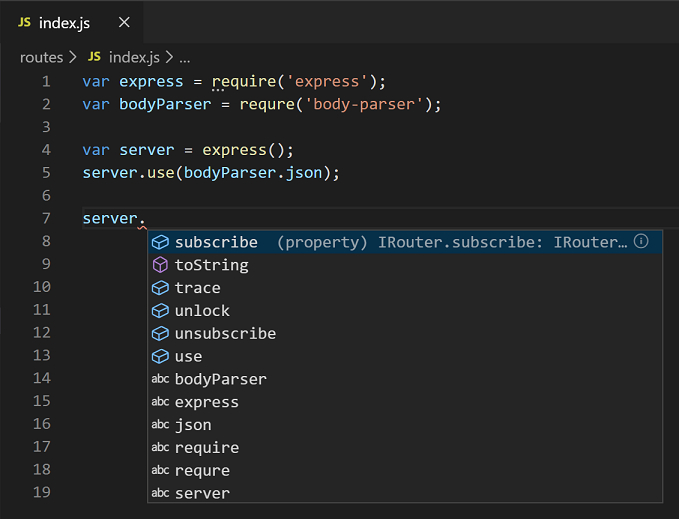

IntelliSense features are sometimes called by other names such as "code completion", "content assist", and "code hinting" in other editor/IDE.

## IntelliSense

IntelliSense is a general term for a variety of code editing features including: code completion, parameter info, quick info, and member lists.

Just use `Ctrl + Space`, You can view available methods, parameter hints, short documentation, etc.

For Going to Definition select a symbol then type F12. Alternatively, you can use the context menu or `Ctrl+ click` (Cmd+click on macOS).

### Types of completions

The JavaScript code below illustrates IntelliSense completions. IntelliSense gives both inferred proposals and the global identifiers of the project. The inferred symbols are presented first, followed by the global identifiers (shown by the Word icon).

VS Code IntelliSense offers different types of completions, including language server suggestions, snippets, and simple word based textual completions.

## Linting

Linting is static code analysis.
It can check syntax error and flag errors, enforce coding convention, remove potential bugs, detecting anti-patterns. You need to extend the linters for more sophisticated code analysis e.g ESLint has .eslintrc.js

For e.g.
JavaScript has two equality comparator == and ===. It’s a good practice, and it avoids much debugging time, to always use ===. If you enable, for instance, ESLint to check for that, it can tell you what part of your code is using == and even replace it for you.

For more details about <a href="https://www.freecodecamp.org/news/what-is-linting-and-how-can-it-save-you-time/" 
target="\_blank"> Linting in vscode </a>

Working with linting in React <a href="https://code.visualstudio.com/docs/nodejs/reactjs-tutorial" target="_blank"> Click here </a>
